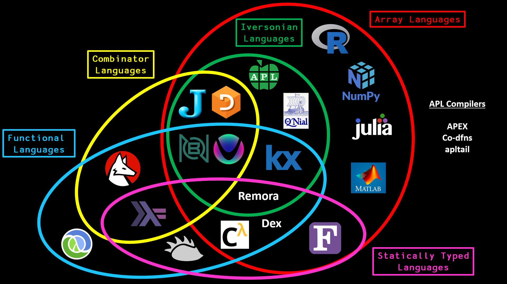

Greetings!

I'm Maximilian Elixhauser, a B.Sc. student specializing in Digitalization-Innovation-Society (DIG) with a focus on Geoinformatics at the University of Salzburg. Over the past two years, I've served as a Research Assistant within the UNIGIS Project, tackling technical writing, problem-solving tasks, debugging, and scripting. This month, I joined the Spatial Simulation Lab Team! In addition to my research duties, I tutor students in the "Web-Project" course at DIG, where I consult on project feasibility, technical stacks, server issues, and programming queries in languages like JavaScript and Python.

For those interested in connecting, feel free to visit my  [LinkedIn](www.linkedin.com/in/maximilian-elixhauser-b5b7b920b){target="_blank"}
or [GitHub](https://github.com/Secreez){target="_blank"} profiles.

I've also co-authored the GPL 3.0 licensed module ["Automated Data Processing with
R"](https://unigis-salzburg.github.io/Opt_AppDev-R/){target="_blank"} in collaboration with Dr. Neuwirth. If you plan to attend the [useR! Conference](https://events.linuxfoundation.org/user/){target="_blank"} in Salzburg this July, I’d be thrilled to meet up and exchange ideas!

Now, let's delve a bit deeper into what the title of this post suggests.

# My Upcoming Thesis: A Deep Dive into Julia's Agents.jl and GAMA

##  The Fascination with Julia

Amidst the [dominance](https://plrank.com){target="_blank"} of JavaScript and Python in the scripting landscape, [Julia](https://julialang.org/){target="_blank"} stands out by bridging the gap between high-level ease of use and low-level efficiency, compiling directly to optimized machine code instead of traditional interpreted bytecode. This unique approach allows Julia to deliver performance on par with C and Fortran, positioning it as a potential game-changer in scientific computing and data analysis. (Rest assured, this isn't just another AI-focused blog post.)

*Image Source: [Code Report Array Language Comparisons](https://github.com/codereport/array-language-comparisons), used under [MIT License](https://github.com/codereport/array-language-comparisons/blob/master/LICENSE). Image modified in scale to enhance clarity.*

Julia excels in array programming, outperforming traditional tools like R and Python’s NumPy, especially in data-intensive scenarios. Its effectiveness is acknowledged not only in academic circles but also by established organizations engaged in high-profile projects. For example, [Circuitscape in Conservation](https://juliahub.com/case-studies/circuitscape){target="_blank"}, supported by [NASA](https://www.nasa.gov/ ){target="_blank"}, and the Climate Modelling Alliance [CliMA](https://clima.caltech.edu/){target="_blank"} extensively use Julia. CliMA has even developed [ClimaCore.jl](https://github.com/CliMA/ClimaCore.jl){target="_blank"}, a package built entirely in Julia for advanced climate modeling. More examples of Julia's applications can be found in the [JuliaHub Case Studies](https://info.juliahub.com/case-studies){target="_blank"}.

## Comparison with R and Python's NumPy 

Julia offers a seamless array programming experience, which contrasts sharply with R and provides a more direct performance comparison with Python’s NumPy. For those coming from a Python background, Julia enhances interoperability through [PyCall.jl](https://github.com/JuliaPy/PyCall.jl){target="_blank"}, allowing direct calls to Python code, which facilitates a smoother transition for Python users and the use of existing Python libraries.

## The Attendees: Agents.jl and GAMA

### Agents.jl: Harnessing Julia for High-Performance ABM

[Agents.jl](https://juliadynamics.github.io/Agents.jl/stable/){target="_blank"} is engineered for performance, leveraging Julia's just-in-time (JIT) compilation to outpace traditional ABM frameworks such as MASON, NetLogo, and Mesa. This is evident from [their benchmarks](https://github.com/JuliaDynamics/ABMFrameworksComparison){target="_blank"}, although it’s important to note that GAMA and GIS data are not included in these tests.

The most recent release [Agents.jl v6.0](https://discourse.julialang.org/t/agents-jl-v6-releases-announcement-post/111678){target="_blank"}, introduces significant improvements and new features. These include the @multiagent macro for efficient multi-agent simulations and an experimental model type, EventQueueABM, for continuous-time simulations, enhancing Agents.jl’s capabilities for traditional ABM tasks.

### GAMA: The Traditional Java-based GIS Platform

Conversely, GAMA is built on Java and is renowned for its robust GIS integrations and modular architecture. It supports complex modeling through a comprehensive set of abstractions like agents, environments, and networks. GAMA's in-house IDE, an amalgamation of [various Eclipse Plugins](https://gama-platform.org/wiki/developingGAMA){target="_blank"}),  facilitates model development with tools for editing, debugging, and execution. Additionally, it leverages the [GeoTools library](https://www.geotools.org/){target="_blank"} for effective geographic data processing.

While Agents.jl offers exceptional speed and ease of use, making it particularly attractive for simulations that demand high computational performance, GAMA provides comprehensive GIS capabilities. My forthcoming thesis will conduct a detailed comparative analysis of these platforms, focusing on their performance in handling GIS data integration and scalability in ABM scenarios.

# Benchmarking Agents.jl and GAMA: Methodology and Metrics

## Research Question

"How do Agents.jl and GAMA compare in terms of computational efficiency, scalability, and ease of GIS data integration in spatial simulations?"

## Hypotheses

**Hypothesis 1**: "Agents.jl will demonstrate superior computational efficiency over GAMA in executing spatial simulations as the number of agents increases, measured by execution time and resource utilization."

**Hypothesis 2**: "GAMA will require less time and effort (measured by setup time and code length) for integrating and manipulating GIS data within spatial simulations compared to Agents.jl."

## Methodology

### Ensuring Reproducibility

**Dedicated Server Setup:** I use a high-performance Linux server from [Hetzner Cloud](https://www.hetzner.com/cloud/){target="_blank"} to ensure consistent conditions for all simulations. This setup helps in maintaining a controlled environment for accurate comparison.

**Docker Containers:** Each simulation runs in an isolated Docker container, which standardizes software conditions across different tests. This isolation helps prevent discrepancies due to varying system configurations.

### Ensuring Transparency

**Open-Source Code:** Transparency is crucial in scientific research. To this end, all scripts, data, and results will be openly available on a public GitHub repository. This allows anyone to verify, replicate, or extend my findings, ensuring that changes and manipulations are clear through version control systems.

### Monte Carlo Simulations

Monte Carlo methods will be employed to manage uncertainties and variability in simulation parameters. This approach not only helps in assessing how input variable changes affect performance outcomes but also ensures that these results are robust and replicable across different scenarios, not just one-time flukes.

### Linear Regression Analysis

Linear regression analysis will be utilized to explore the relationship between the number of agents and computational load. This will aid in quantifying the scalability and efficiency of the platforms. The analysis is critical for verifying Hypothesis 1, illustrating how system performance varies with increased simulation complexity.

### Performance Metrics

- **Setup Time:** Measure the time taken by the simulation programs to initialize.

- **Execution Time:** Measure the duration of the simulation runs.

- **CPU and RAM Usage:** Monitor resource utilization during simulations.

- **Preparation/Rendering Time:** Include the time taken to prepare and render the simulation models.

### Benchmark Scenarios

**Headless vs. Non-Headless Testing:** Conduct both headless (without GUI) and non-headless (with GUI) tests to understand the impact of graphical rendering on performance.

**Differential Analysis:** Calculate the difference in performance metrics between headless and non-headless modes to determine the overhead introduced by the GUI.

**GIS Integration Efficiency:** Evaluate how easily and efficiently each platform integrates and processes spatial data, a key factor for applications, especially in geoinformatics.

**Time and Resource Utilization:** Measure execution time and resource consumption for each platform under various agent counts and simulation complexities. This metric is essential for determining the operational efficiency of the platforms in different settings.

### Anticipated Outcomes

So, the goal of this thesis is to provide practical insights into how Agents.jl and GAMA perform under various conditions, particularly focusing on their computational efficiency and GIS data integration capabilities. The findings should help clarify which platform may be more suitable for specific tasks in geoinformatics, supporting researchers and practitioners in making informed choices based on empirical evidence.

### Closing Thoughts

Keeping pace with technological advancements is essential in any technical field, and this thesis is a step towards understanding how different tools can be effectively utilized. By comparing Agents.jl and GAMA, I aim to offer a clear, factual perspective on their usability and performance. I hope this work will be useful for those exploring these platforms, and I am open to discussions or feedback based on the findings presented.

Stay tuned for further updates on my thesis and other related insights that might emerge along the way.

Thanks for reading, and I look forward to sharing more with you soon!

Best regards,
Maximilian Elixhauser
